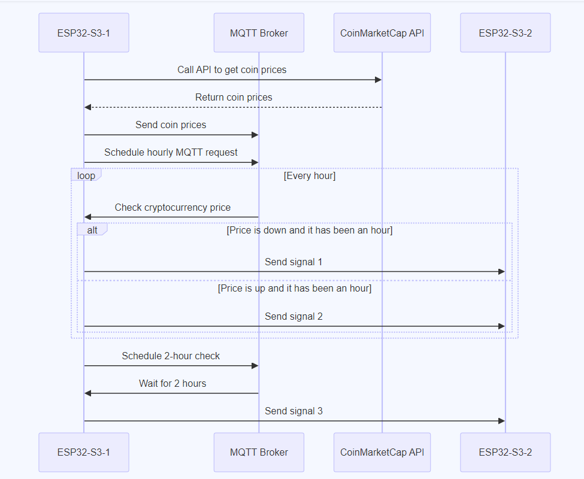
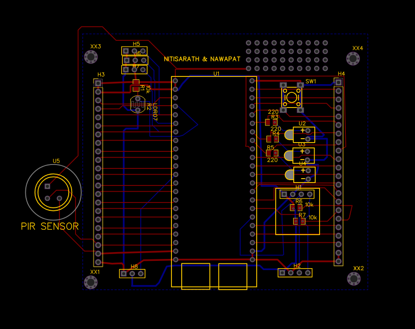
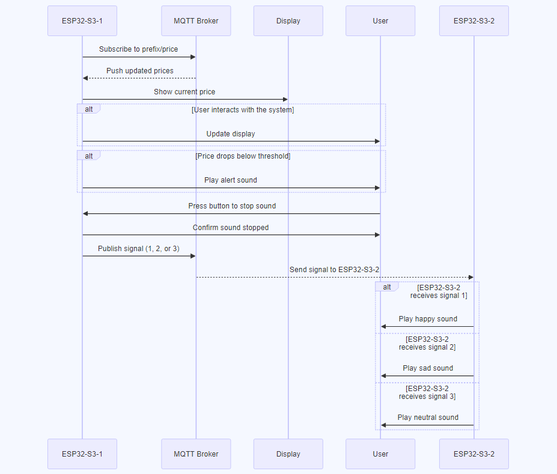
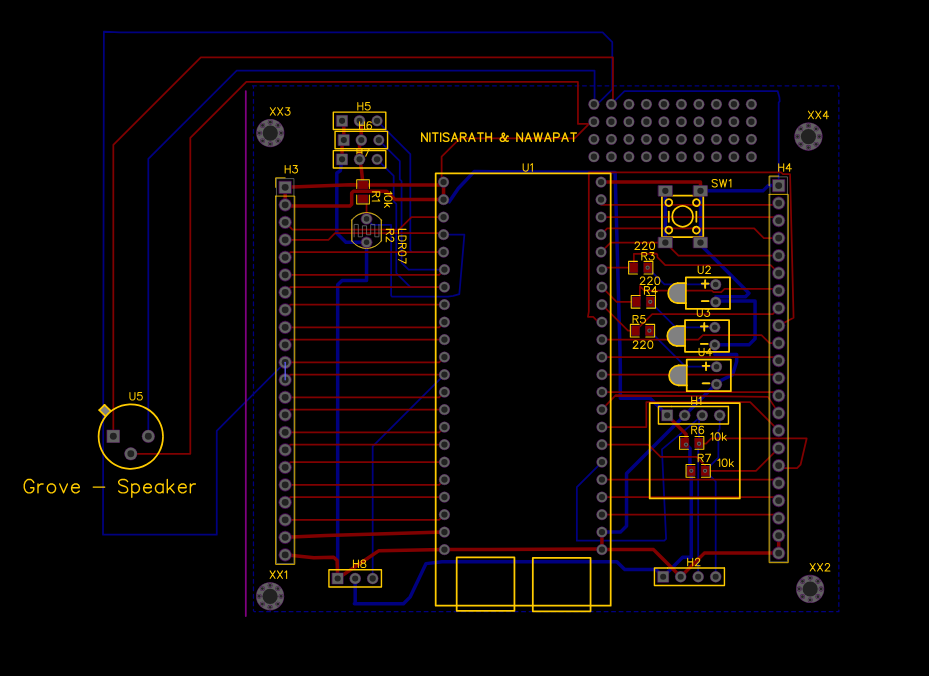
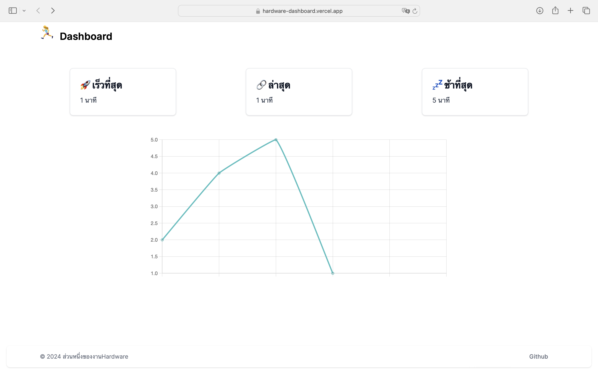

# Cryptocurrency Alert Project

Cryptocurrency Alert Project เป็นแนวทางใหม่ในการแก้ปัญหาการนั่งนาน กระตุ้นให้ผู้ใช้ Bitcoin ออกกำลังกาย ลุกขึ้นยืน มีการเดินเพื่อคลายก้ามเนื้อ มีการเปลี่ยนพฤติกรรมการใช้ชีวิต ผ่านระบบแจ้งเตือนด้วยราคาของเหรียญสกุลเงินดิจิทัล

## จัดทำโดย

- คริษฐ์ธร บำรุงพิพัฒนพร 6610501998
- นวพรรษ บัวเกิด 6610502111
- นิธิศรัฎฐ์ พุฒิภาพงศ์ 6610502129
- ชนุตร์ ชาญสง่าเวช 6610505322

## หลักการทำงาน

สำหรับการทำงานหลักๆเราจะมีตัว ESP32-S3 ที่ใช้ในโปรเจ็คนี้ 2 บอร์ด โดยมีรายละเอียดดังนี้

**สำหรับบอร์ดที่หนึ่ง (ESP32-S3 #1)**

- การทำงานรวมถึงการเรียกใช้ API จาก CoinMarketCap และการส่งค่าราคาเหรียญไปที่ `${prefix/price}` โดยมีเนื้อหาคือ `${coin},${value}` และจะส่งเข้าไปที่ MQTT Broker 
- ทุกๆ 1 ชั่วโมงจะทำการส่ง MQTT ไปที่ `${prefix}/ring` เพื่อให้ตัว ESP32-S3 #2 ทำการเล่นเสียงแจ้งเตือน จะเเบ่งเป็นสองเสียง เสียงที่หนึ่งเหมือนเหรียญขึ้น 
- ทุกๆ 2 ชั่วโมงจะทำการส่ง MQTT ไปที่ `${prefix}/ring` เพื่อให้ตัว ESP32-S3 #2 ทำการเล่นเสียงแจ้งเตือน ให้คนได้มีการลุกขึ้นมาจากที่นั่งเพื่อไปกดปุ่มเพื่อหยุดการแจ้งเตือนของบอร์ดที่สอง โดยจะมีการตรวจจับการเคลื่องไหวด้วย pir sensor เพื่อตรวจสอบว่าผู้ใช้นั้งอยู่หน้าคอมอยู่หรือไม่ถ้าไม่ระบบจะทำการรีเซตเวลาเเจ้งเตือนทำให้ไม่เเจ้งเตือนเวลาผู้ใช้ทำธุระอย่างอื่นอยู่

**สำหรับบอร์ดที่สอง (ESP32-S3 #2)**

- แสดงราคาเหรียญบนจอแสดงผล พร้อมทั้งชื่อเหรียญ ราคา การเปลี่ยนแปลงของราคา และ เปอร์เซ็นต์การเปลี่ยนแปลงของราคา
- เล่นเสียงเมื่อได้รับสัญญานแจ้งเตือนจากบอร์ดเเรกโดยการเล่นเสียงจะมี 3 เสียง คือ
  - เสียงขึ้น 
  - เสียงลง 
  - เสียงเเจ้งเตือนให้ผู้ใช้มีการลุกจากที่นั่งเพื่อไปกดปุ่มบอร์ดที่ 1 ให้หยุดการเเจ้งเตือนเพื่อไม่ให้ผู้ใช้นั่งนานจนเกินไป โดยผู้ใช้จะต้องไปกดปุ่มที่บอร์ดที่หนึ่งค้างไว้ประมาณ 1 วินาที เพื่อให้เสียงเเจ้งเตือนหยุด

**Dashboard**

กราฟแสดงเวลาที่ใช้ในการเดินมากดปุ่มจากการแจ้งเตือนของบอร์ดที่ 2
โดยการทำงานของ Dashboard (NextJS) จะรับค่าจาก API ที่มาจากทาง Node-RED โดย Node-RED จะรับค่าจาก MQTT ที่ topic `${prefix}/Time2press` โดยมีเนื้อหาคือ `[time_n1, time_n2, ...]`

## วิธีการติดตั้ง

1. นำไฟล์ในโฟลเดอร์ `./src/module` อัปโหลดเข้าไปในบอร์ด ESP32-S3 ทั้งสองบอร์ด
2. นำไฟล์ `./src/Node-RED.json` ไป Import ใน Node-RED
3. นำไฟล์ `./src/apps/dashboard` ไปใช้งานโดยการรันคำสั่ง `cd ./src/apps/dashboard && npm install` จากนั้นก็อปปี้ `.env.example` ไปเป็น `.env` และตั้งค่า `NEXT_PUBLIC_API_URL` ให้เป็น URL ของ Node-RED ที่ใช้งาน ยกตัวอย่างเช่น `https://iot.cpe.ku.ac.th/red/b6610502129/test/hello.txt` เมื่อเสร็จสิ้นให้รันคำสั่ง `npm run start`
4. จากนั้นเราจะมาเริ่มรันตัว ESP32-S3 โดยจะต้องตั้งค่าใน `./src/module/config.py` ก่อน​ซึ่งก็จะมีค่าของ MQTT, TOPIC_PREFIX, COINMARKETCAP_API_KEY จากนั้นเราจะแบ่งเป็นรันคำสั่งของสองบอร์ดซึ่งก็คือ `./src/esp32-s3-01.py` และ `./src/esp32-s3-02.py` 

## รายการอุปกรณ์

- **Board ESP32-S3 x2:** บอร์ดที่ใช้สำหรับการรันคำสั่งต่างๆ
- **Grove - Speaker:** ใช้สำหรับเล่นเสียงแจ้งเตือนเมื่อราคาเหรียญตกลงต่ำกว่าค่าที่ตั้งไว้ [Grove - Speaker](https://th.cytron.io/p-grove-speaker)
- **OLED Display:** ใช้แสดงราคาเหรียญและข้อมูลอื่นๆ บนจอ [OLED Display](https://th.cytron.io/p-oled-i2c-0.96inch-128x64-blue-display)
- **Push Button 4-Pin:** ใช้เพื่อเลือกเหรียญที่ต้องการแสดงบนจอและตั้งค่าการแจ้งเตือน [Push Button 4-Pin](https://th.cytron.io/p-6x6x1-push-button-4pin)
- **LED 3mm (Red, Green, Yellow):** ใช้เป็นตัวบ่งชี้สถานะการทำงาน, สถานะการเชื่อมต่อ, และการแจ้งเตือน
- **HC-SR501 PIR Motion Sensor:** ใช้สำหรับการตรวจสอบการเคลื่อนไหว เพื่อที่จะตรวจสอบว่ามีคนนั่งอยู่บนโต๊ะหรือไม่ [HC-SR501 PIR Motion Sensor](https://www.lazada.co.th/products/hc-sr501-pir-motion-sensor-arduino-nodemcu-esp32-esp8266-i1420660825-s12635627965.html?spm=a2o4m.tm80167383.2074280300.1.4081dKhEdKhEF2.4081dKhEdKhEF2)

## ข้อมูลอ้างอิง

Youtube: [Youtube Demo](https://www.youtube.com/watch?v=a6oo5drq0ws)

Dashboard: [Dashboard](https://hardware-dashboard.vercel.app/)

MMLParser: [MMLParser](https://gitlab.com/cjaikaeo/mmlparser-python/-/blob/master/mmlparser/mmlparser.py?ref_type=heads)

Github: [Source](https://github.com/WingPriao/Hardware/tree/main/Project/Group%202)